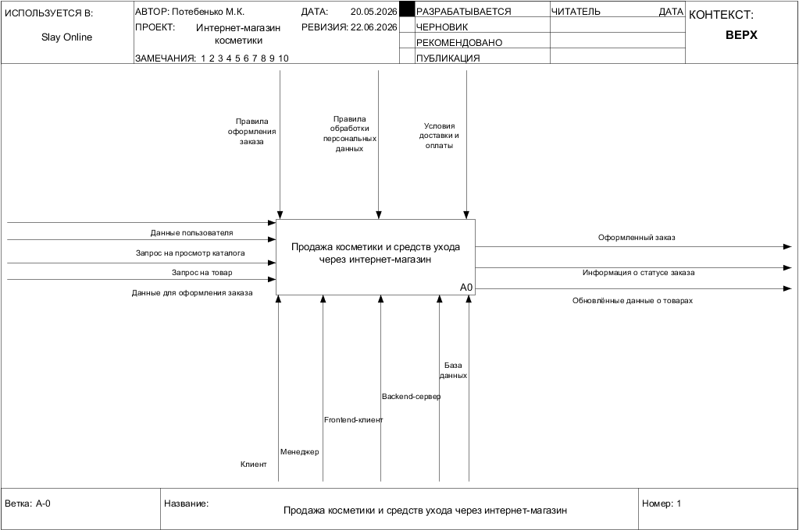
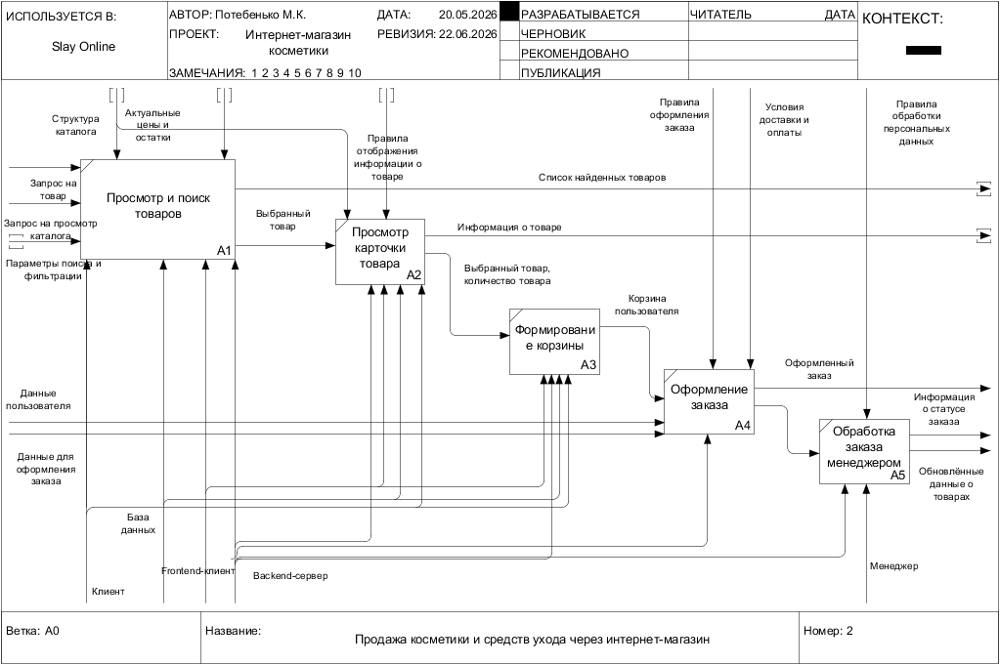
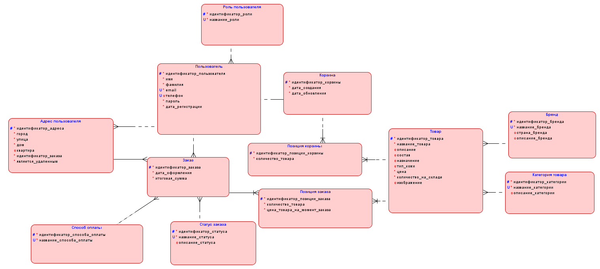
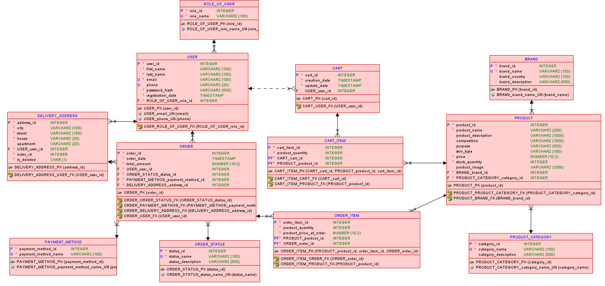
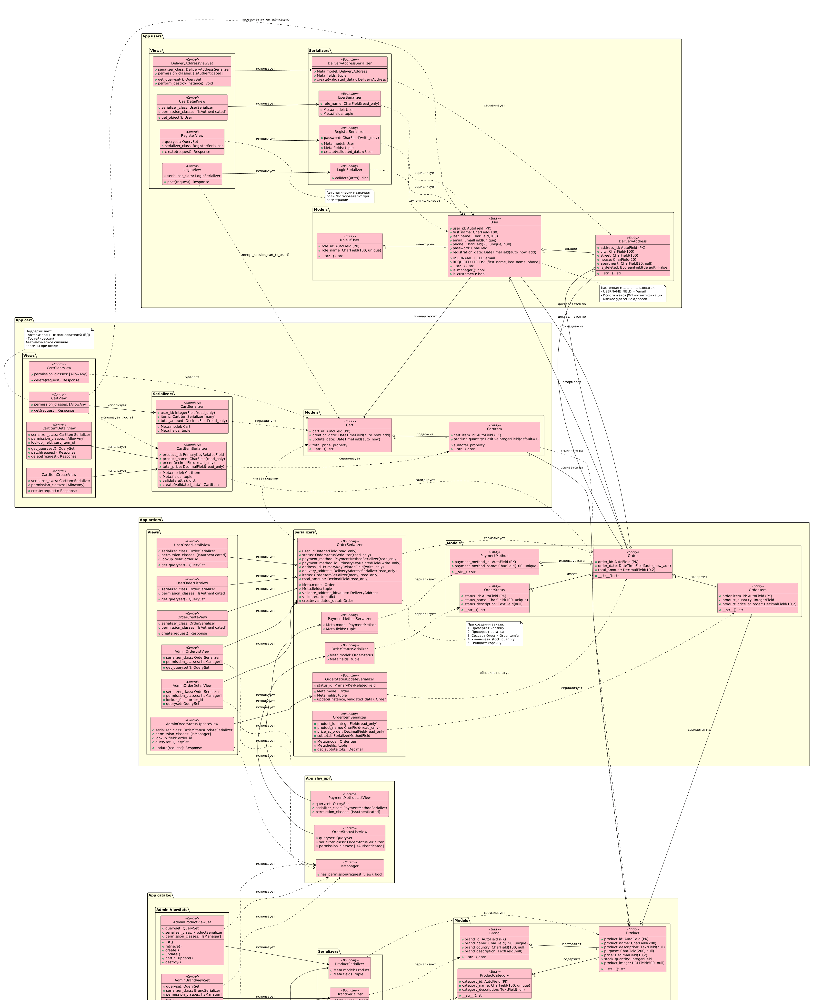
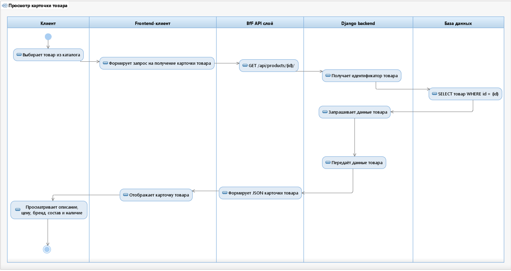
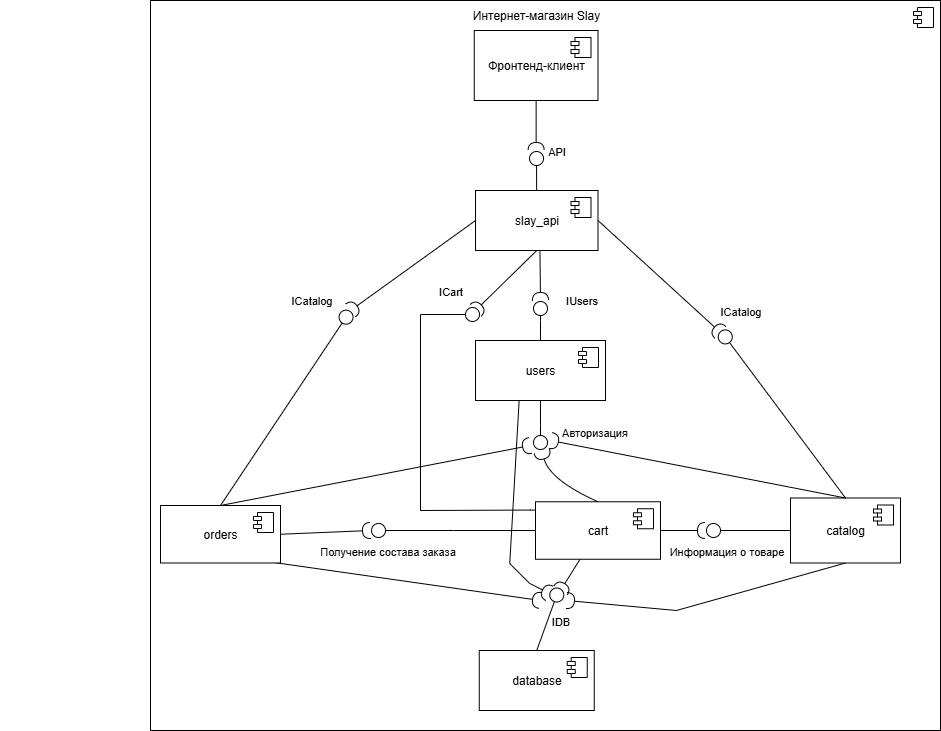
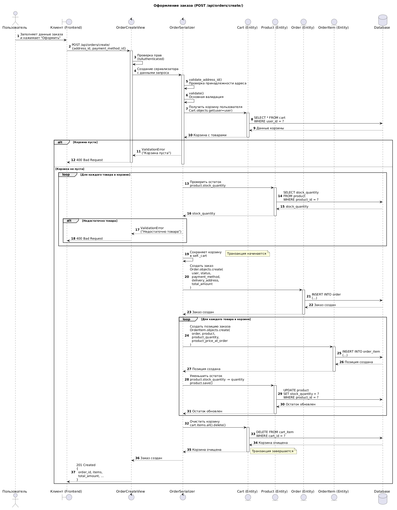
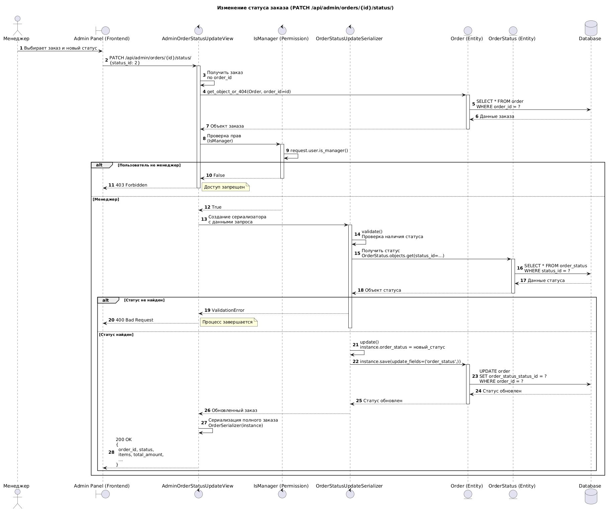
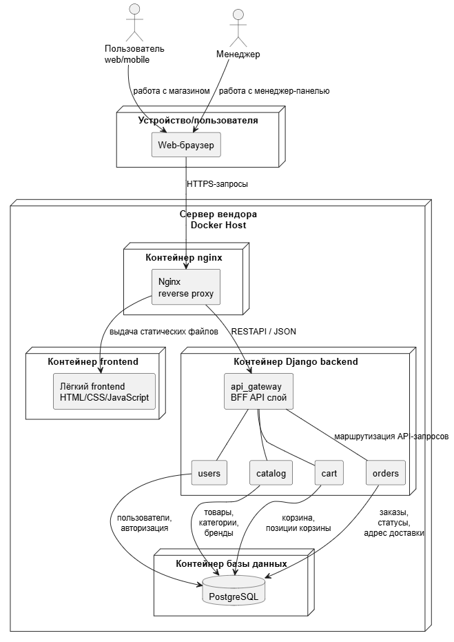

# Проектирование информационной системы  
---
  
## Анализ и формирование требований  

### Описание предметной области  

**Сфера**: E-commerce. Электронная торговля косметикой и средствами ухода  
**Целевая аудитория**: Женский пол всех возрастов  
**Решаемая задача**: Автоматизация процесса торговли косметикой  

### Описание бизнес-процесса продажи косметики в нотации IDEF0  

  

  

### Функциональные требования (Use Case)  

  

    
[Спецификация ВИ](./Спецификации%20ВИ.md)  

> На этапе реализации отказалась от ВИ "Посмотреть товары по фильтрам" и "Найти товар". Эти функции будут реализованы позже в следующей версии.  

### Нефункциональные требования  
#### 1. Производительность и надежность  

- **Стабильность:** Система должна обеспечивать стабильный отклик критических узлов (корзина, профиль, оплата, доставка) вне зависимости от пиковых нагрузок.  
- **Время ответа:** API (REST, JSON) должно обрабатывать запросы от всех типов клиентов (Web, Mobile, Admin) с временем ответа не более 2 секунд.  
- **Масштабируемость:** Архитектура BFF и выбор стека (Python/Django/PostgreSQL) должны позволять горизонтальное масштабирование для обработки роста количества пользователей и данных.  
- **Доступность:** Система должна быть доступна 98% времени в рабочем состоянии, с регламентированным временем восстановления после сбоев.  

#### 2. Безопасность и соответствие  

- **Шифрование:** Весь трафик между клиентами и сервером должен быть зашифрован с использованием протокола HTTPS.  
- **Аутентификация и авторизация (RBAC):**  
    - Доступ к базовым операциям (оформление заказа, личный кабинет) — только для авторизованных пользователей (JWT/Token).  
    - Доступ к административной панели и управлению данными — строго для учетных записей с правами `is_staff`/`is_superuser`.  
- **Защита данных:** На стороне бэкенда обязательна сквозная валидация и фильтрация входных данных для предотвращения SQL-инъекций и несанкционированной модификации.  
- **Работа с ПД:** Обработка и хранение персональных данных пользователей должны соответствовать требованиям законодательства (152-ФЗ).  

#### 3. Совместимость и переносимость  

- **Клиентская совместимость:**  
	- **Веб-приложение:** Система должна корректно отображаться и функционировать через десктопные браузеры (последние версии Chrome, Firefox, Safari, Edge) на операционных системах Windows, macOS, Linux. Поддержка адаптивной верстки для планшетных устройств (iPad).  
	- **Мобильное приложение:** Должно поддерживать iOS 15+ и Android 10+.  
- **Сетевая совместимость:** Мобильное приложение должно корректно работать в условиях мобильного интернета (3G/4G/5G), обеспечивая быструю загрузку облегченных данных через BFF.  
- **Интеграционная совместимость:** Взаимодействие между клиентами и сервером организовано через REST API с JSON-пакетами, что изолирует логику отображения от бизнес-логики бэкенда.  

## Проектирование  
  
### Логическая модель базы данных  

  

### Даталогическая модель базы данных  

  

Созданные классы моделей Django ORM:  
- [Модели приложения users](../backend/users/models.py)  
- [Модели приложения catalog](../backend/catalog/models.py)  
- [Модели приложения cart](../backend/cart/models.py)  
- [Модели приложения orders](../backend/orders/models.py)  

### Диаграмма классов  

  

Исходные файлы диаграмм в формате PlantUML:  
- [class_diagram_users.plantuml](./plantuml_diagrams/class_diagram_users.plantuml)  
- [class_diagram_orders.plantuml](./plantuml_diagrams/class_diagram_orders.plantuml)  
- [сlass_diagram.plantuml](./plantuml_diagrams/сlass_diagram.plantuml)  

### Диаграмма активности "Просмотр карточки товара"  

  

### Диаграмма компонентов  

  

### Эндпоинты каждого компонента  

[OpenAPI спецификация (schema.yaml)](../backend/schema.yaml)  

#### Приложение `users` (Аутентификация и Профиль)  

Отвечает за регистрацию, авторизацию, управление профилем и адресами.  

[Исходный код приложения users](../backend/users/)  

| HTTP Метод | Эндпоинт                     | Описание (Use Case)                                                                                           | Доступ         |
| :--------- | :--------------------------- | :------------------------------------------------------------------------------------------------------------ | :------------- |
| `POST`     | `/api/users/register/`       | **Зарегистрироваться** (Создание нового пользователя)                                                         | Публичный      |
| `POST`     | `/api/users/login/`          | **Авторизоваться** (Получение JWT Access и Refresh токенов, соединение сессионной и пользовательской корзины) | Публичный      |
| `GET`      | `api/users/me/`              | Получить данные текущего авторизованного пользователя                                                         | Авторизованный |
| `PATCH`    | `api/users/me/`              | Обновить свои данные                                                                                          | Авторизованный |
| `GET`      | `/api/users/addresses/`      | Получить список всех сохраненных адресов доставки                                                             | Авторизованный |
| `POST`     | `/api/users/addresses/`      | Добавить новый адрес доставки                                                                                 | Авторизованный |
| `DELETE`   | `/api/users/addresses/{id}/` | Удалить адрес доставки                                                                                        | Авторизованный |

П.С. в базе данных в таблице RoleOfUser только две роли: Менеджер и Пользователь  

При регистрации пользователь обязательно указывает:  
- фамилия  
- имя  
- почта  
- пароль  

При авторизации:  
- почта  
- пароль  

Особенности:  
- При регистрации пользователь автоматически получает роль "Пользователь"  
- Менеджеры создаются через админку вручную  

---

#### Приложение `catalog`  

[Исходный код приложения catalog](../backend/catalog/)  

| HTTP Метод                 | Эндпоинт                      | Описание (Use Case)                      | Доступ    |
| :------------------------- | :---------------------------- | :--------------------------------------- | :-------- |
| **Товары (Products)**      |                               |                                          |           |
| `GET`                      | `/api/products/`              | **Просмотреть каталог товаров** (список) | Публичный |
| `GET`                      | `/api/products/{id}/`         | **Просмотреть карточку товара** (детали) | Публичный |
| `POST`                     | `/api/admin/products/`        | **Создать новый товар**                  | Менеджер  |
| `PUT/PATCH`                | `/api/admin/products/{id}/`   | **Изменить данные товара**               | Менеджер  |
| `DELETE`                   | `/api/admin/products/{id}/`   | **Удалить товар**                        | Менеджер  |
| **Категории (Categories)** |                               |                                          |           |
| `GET`                      | `/api/categories/`            | Получить список категорий                | Публичный |
| `GET`                      | `/api/categories/{id}/`       | Получить информацию о категории          | Публичный |
| `POST`                     | `/api/admin/categories/`      | Создать новую категорию                  | Менеджер  |
| `PUT/PATCH`                | `/api/admin/categories/{id}/` | Изменить категорию                       | Менеджер  |
| `DELETE`                   | `/api/admin/categories/{id}/` | Удалить категорию                        | Менеджер  |
| **Бренды (Brands)**        |                               |                                          |           |
| `GET`                      | `/api/brands/`                | Получить список брендов                  | Публичный |
| `GET`                      | `/api/brands/{id}/`           | Получить информацию о бренде             | Публичный |
| `POST`                     | `/api/admin/brands/`          | Создать новый бренд                      | Менеджер  |
| `PUT/PATCH`                | `/api/admin/brands/{id}/`     | Изменить данные бренда                   | Менеджер  |
| `DELETE`                   | `/api/admin/brands/{id}/`     | Удалить бренд                            | Менеджер  |

---
#### Приложение `cart` (Пользовательская + Сессионная)  

[Исходный код приложения cart](../backend/cart/)  

| HTTP Метод | Эндпоинт                | Описание (Use Case)                    | Доступ                        |
| ---------- | ----------------------- | -------------------------------------- | ----------------------------- |
| `GET`      | `/api/cart/`            | Получить содержимое корзины            | Публичный _(нужна сессия)_ |
| `POST`     | `/api/cart/items/`      | **Добавить товар в корзину**           | Публичный _(нужна сессия)_ |
| `PATCH`    | `/api/cart/items/{id}/` | **Изменить корзину** (кол-во)          | Публичный _(нужна сессия)_ |
| `DELETE`   | `/api/cart/items/{id}/` | **Изменить корзину** (удалить позицию) | Публичный _(нужна сессия)_ |
| `DELETE`   | `/api/cart/clear/`      | Очистить корзину                       | Публичный _(нужна сессия)_ |

---

#### Приложение `orders`  

[Исходный код приложения orders](../backend/orders/)  

**Для Авторизованного пользователя:**  

| HTTP Метод | Эндпоинт            | Описание (Use Case)                                                                                            | Доступ         |
| :--------- | :------------------ | :------------------------------------------------------------------------------------------------------------- | :------------- |
| `POST`     | `/api/orders/`      | **Оформить заказ** (Принимает `address_id` и `payment_method_id`. Переносит корзину в заказ и очищает корзину) | Авторизованный |
| `GET`      | `/api/orders/`      | **Просмотреть историю заказов** (Список всех своих заказов)                                                    | Авторизованный |
| `GET`      | `/api/orders/{id}/` | **Просмотреть статус заказа** (Детали конкретного заказа, его статус и состав)                                 | Авторизованный |

**Для Менеджера (Админ панель заказов):**  

| HTTP Метод | Эндпоинт | Описание (Use Case) | Доступ |
| :--- | :--- | :--- | :--- |
| `GET` | `/api/admin/orders/` | **Просмотреть список заказов** (Все заказы всех пользователей, с фильтром по статусу) | Менеджер |
| `PATCH` | `/api/admin/orders/{id}/status/`| **Изменить статус заказа** (Передать новый ID статуса из справочника) | Менеджер |
| `GET` | `/api/admin/orders/{id}/` | Посмотреть детали любого заказа (для сверки) | Менеджер |

---

#### Приложение `slay_api` (Справочные данные)  

[Исходный код приложения slay_api](../backend/slay_api/)  

| HTTP Метод | Эндпоинт | Описание (Use Case) | Доступ |
| :--- | :--- | :--- | :--- |
| `GET` | `/api/payment-methods/` | Получить список доступных **Способов оплаты** (из вашей БД) | Авторизованный |
| `GET` | `/api/order-statuses/` | Получить список **Статусов заказа** (для отображения на фронте или в фильтре менеджера) | Авторизованный |

### Диаграмма последовательности "Оформление заказа"  

  

Исходный файл: [sequence_d1.plantuml](./plantuml_diagrams/sequence_d1.plantuml)  

### Диаграмма последовательности "Изменение статуса заказа (менеджер)"  

  

Исходный файл: [sequence_d2.plantuml](./plantuml_diagrams/sequence_d2.plantuml)  

### Диаграмма развертывания системы  

  

Исходный файл: [deployment.plantuml](./plantuml_diagrams/deployment.plantuml)  

Для тестовой реализации достаточно одного сервера вендора с установленными Docker и Docker Compose.  

## Тестовая реализация  

- [История создания](./История%20создания.md)  

**Файлы тестов:**  
- [Приложение users: tests.http](../backend/users/tests.http)  
- [Приложение catalog: tests.http](../backend/catalog/tests.http)  
- [Приложение cart: tests.http](../backend/cart/tests.http)  
- [Приложение orders: tests.http](../backend/orders/tests.http)  
  
**Конфигурационные файлы проекта:**  
- [Dockerfile бэкенда](../backend/Dockerfile)  
- [Dockerfile фронтенда](../frontend/Dockerfile)  
- [docker-compose.yml](../docker-compose.yml)  
- [requirements.txt](../backend/requirements.txt)  
  

  - [Скрины работы](./Скрины%20работы.md)  