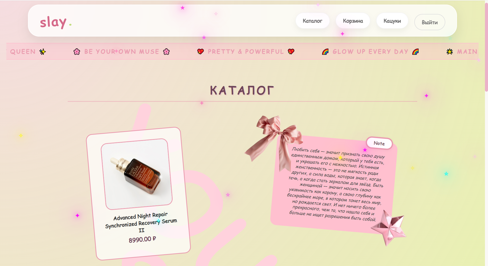
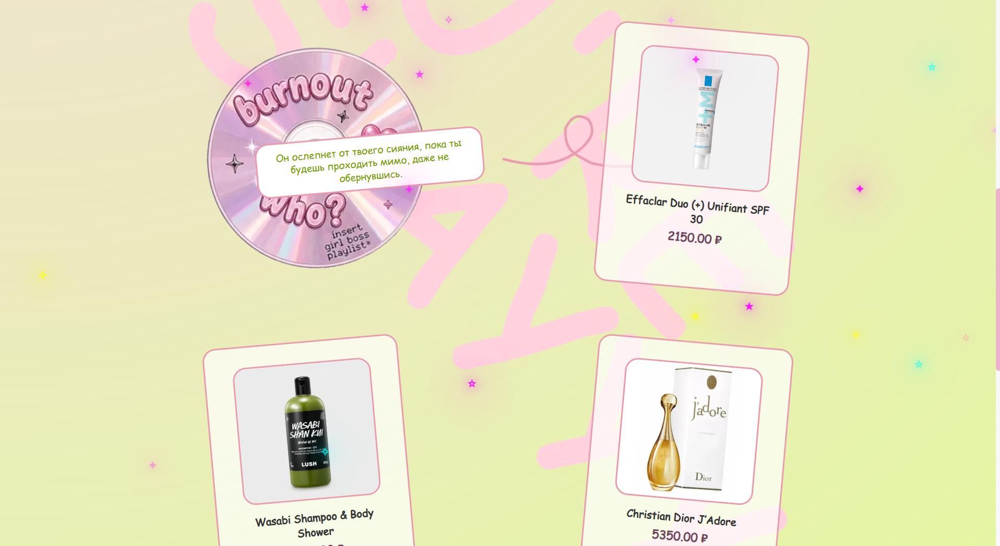
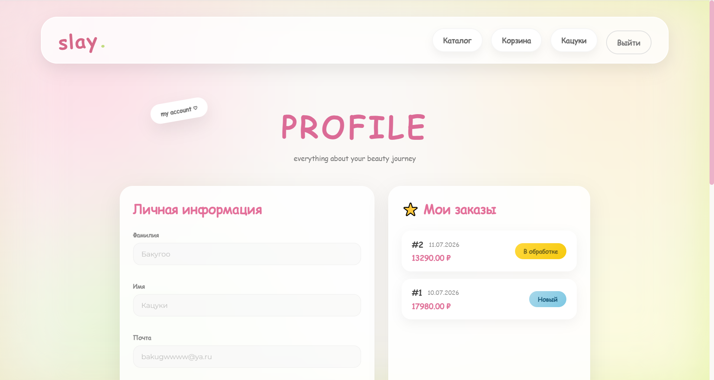
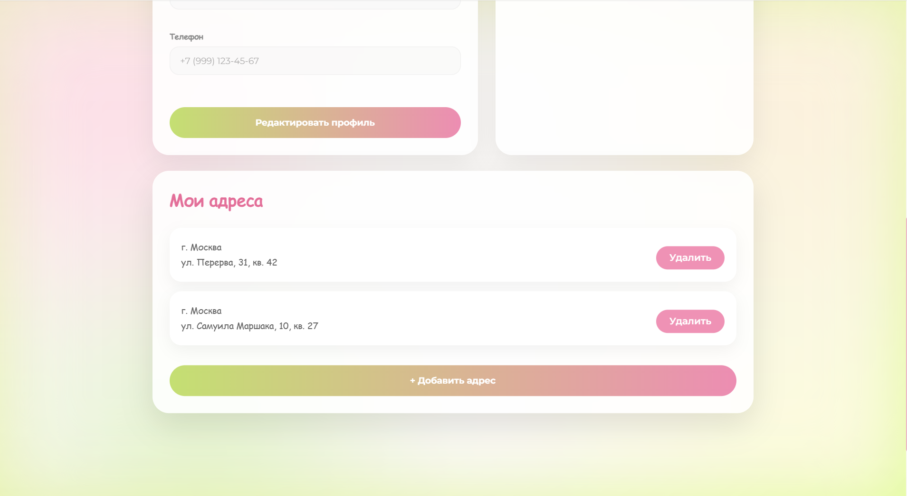
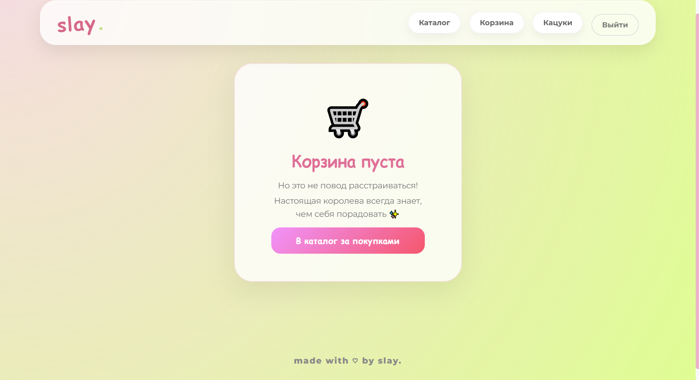
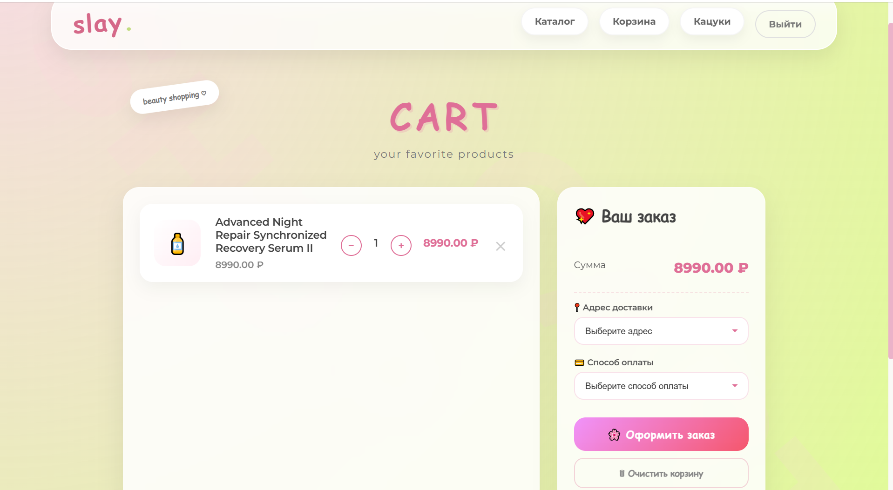
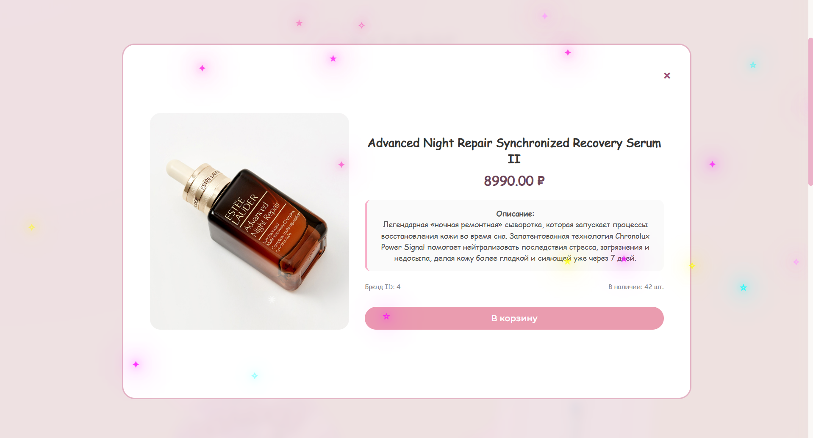
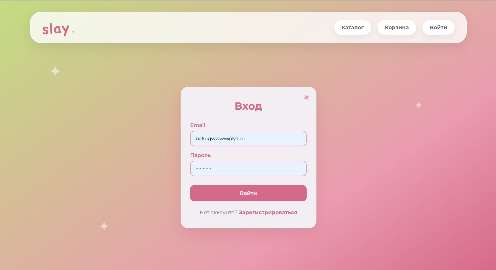
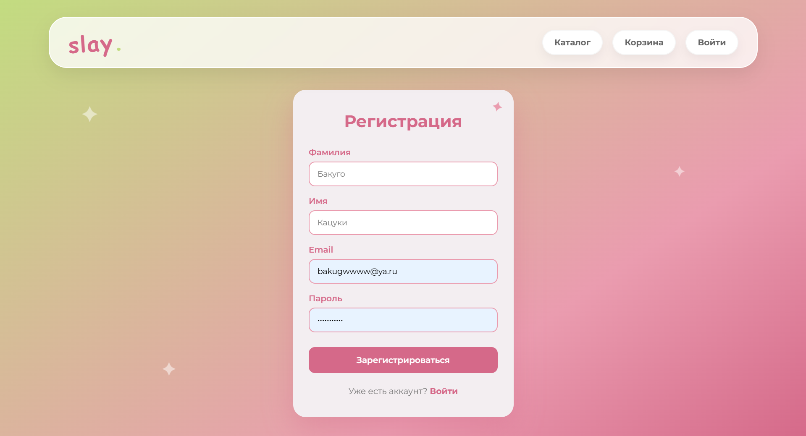
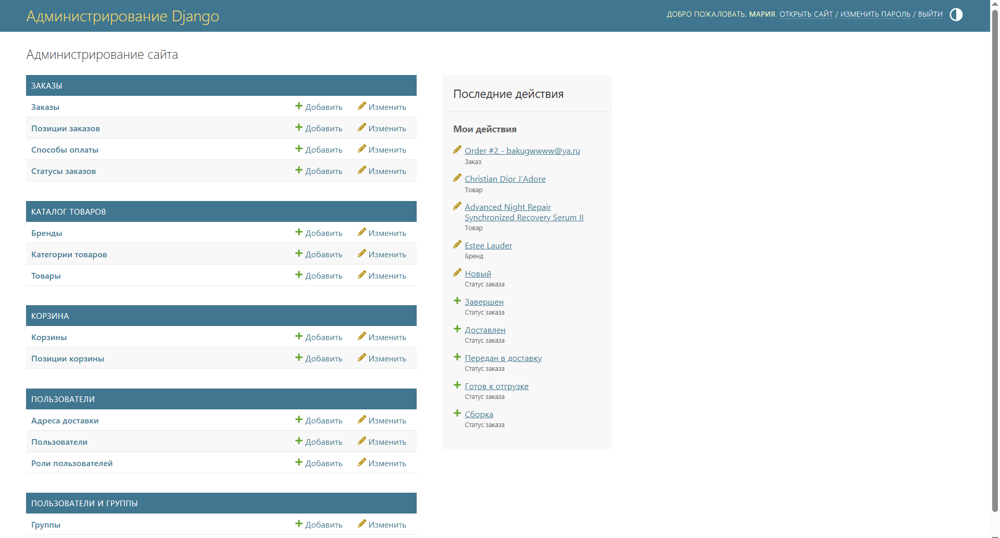

# Скрины работы клиента  

## Home  

  
  
  

## Profile  

  
  

## Cart  

  
  

## ProductCard  

  

P.S. В MVP-версии фронтенд-клиента не реализовано слияние корзин, поэтому для добавления в корзину нужно войти. В последующих версиях фронта будет реализовано.  

## Authorization  

  

## Registration  

  

## Admin Panel  

  
  
P.S. Это админ-панель Django для суперюзеров. Для менеджеров должна быть другая панель - менеджер-панель (все эндпоинты реализованы). Просто в MVP-реализации фронтенд-клиента ограничилась тем, что менеджеры управляют заказами через админку Django. В следующих версиях фронтенда я пропишу менеджер-панель.